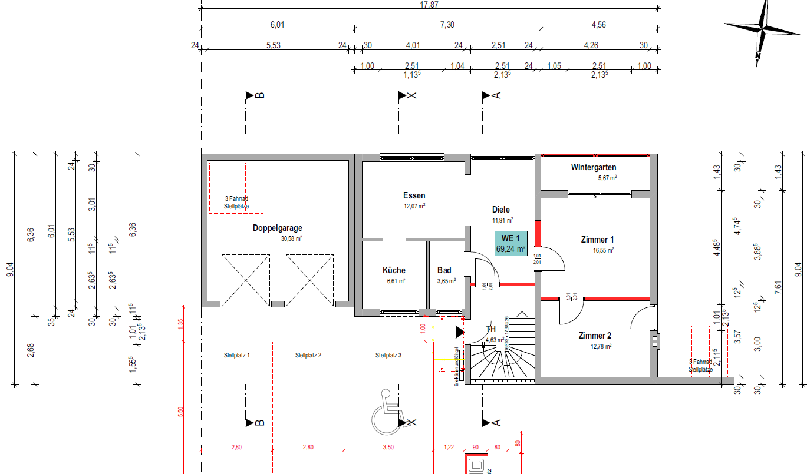
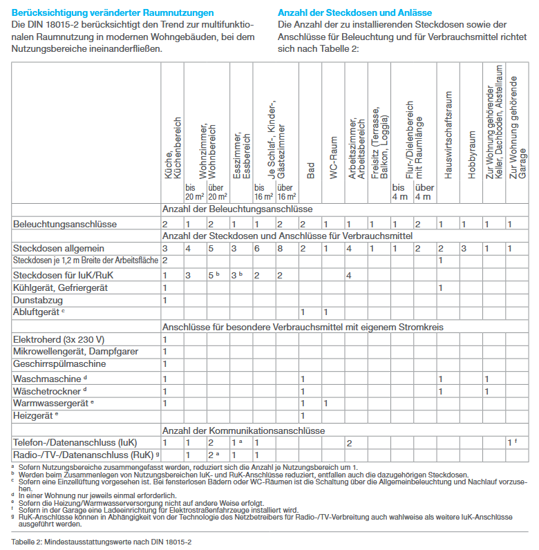

# Auftragsbeschreibung Elektro-Arbeiten
- Zwei Bau-Abschnitte;
- Verbau von [Busch+Jäger BALANCE SI](https://www.busch-jaeger.de/produkte/schalterprogramme/busch-balance-si)
- Grobe Orientierung an DIN 18015: https://hager.com/de/wissen/normen/din-18015
- Abschnitt 10 ("Mindest­aus­stat­tung elek­tri­scher Anlagen in Wohn­ge­bäuden") sieht meiner Meinung nach viel zu viele Steckdosen vor (z.B. 2+8 Anschlüsse+Steckdosen für Schlafzimmer über 16 QM)

## Bau-Abschnitt 1 "Arkani" (2. Quartal 2026)

### Zählerschrank
- Im Flur/Treppenhaus im "Kellergeschoss"
- Großräumig: Platz für 5 Zähler
- Verbau von 4 Zählern (3 Wohn-Einheiten, 1 Haus-Strom)
- Koordination mit örtlichem Energieversorger/Stadtwerke, sowie entspr. örtlicher TAB (Technische Aufschaltbedingungen für Brandmeldeanlagen)
- Blitzschutz-/Ableitung
- Inkl. RJ45-Buchse

### Sprechanlage
- Nur Audioell 

### WE1 (Erdgeschoss)
- Verlegung Datenkabel (Cat 8)
- Wohnzimmer-Südseite (neues Zimmer): Deckenlampe; SchuKo-Steckdosen
- Leitungen f. Wintergarten (Deckenlampe)
- Info: 73 QM: Mindest­an­zahl der Strom­kreise für Steck­dosen und Beleuch­tung: 4

### Erdgeschoss/Vorbereitung Wallbox in der Garage; Verlegung z.T. Auf-Putz
- Verlegung 6 mm² Stromkabel (d.h. geeignet für 22kW)

### Abschluss Bau-Abschnitt Arkani
- Prüfung
- Stromlaufpläne
- Verteilerplan

## Bau-Abschnitt 2 "Bisasam"

### WE2 (Obergeschoss)
- Verlegung Datenkabel (Cat 8)
- Verlegung Telefonkabel
- Herd Überprüfen
- Info: 87 QM: Mindest­an­zahl der Strom­kreise für Steck­dosen und Beleuch­tung: 5
- 

### WE3 (Dachgeschoss)
Neuverkabelung (Telefon-, Fernseh- und Daten-Kabel (wieder Cat 8))
- Sicherungskasten in WE3 (Raum "Abst."); 9 Fehlerstrom-Schutzschalter/Sicherungen (jeder Raum einer, plus 3 für Herd)
- Info: 73 QM: Mindest­an­zahl der Strom­kreise für Steck­dosen und Beleuch­tung: 4

### Abschluss Bau-Abschnitt Bisasam
dito wie oben

## Anzahl Beleuchtungs-Anschlüsse + Steckdosen

[Link zum Standard](https://assets.sc.hager.com/de/-/media/project/hagerdeep/deutschland/hager/b2b-de/documents/hagertipps/23de0014-tip-hagertipp-21-web.pdf?la=de-de&hash=EA21A82429E22CD026F84A76F12B4DBA)

