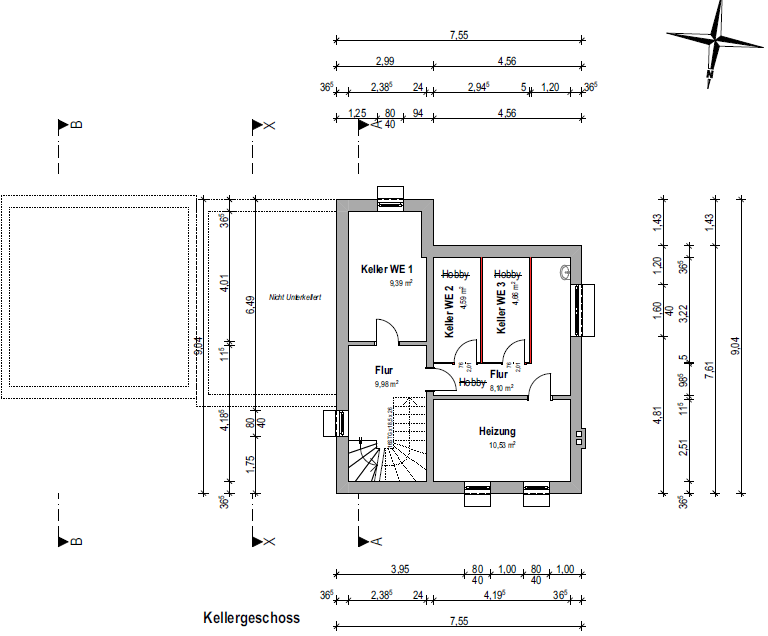
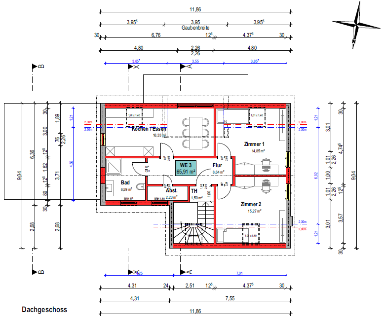

# Auftragsbeschreibung Elektro-Arbeiten
- Zwei Bau-Abschnitte;

## Bau-Abschnitt 1 "Arkani" (2. Quartal 2026)

### Zählerschrank
- Im Flur/Treppenhaus im "Kellergeschoss"
- Großräumig: Platz für 5 Zähler
- Verbau von 4 Zählern (3 Wohn-Einheiten, 1 Haus-Strom)
- Koordination mit örtlichem Energieversorger/Stadtwerke, sowie entspr. örtlicher TAB (Technische Aufschaltbedingungen für Brandmeldeanlagen)
- Blitzschutz-/Ableitung
- Inkl. RJ45-Buchse

### Sprechanlage
- Nur Audioell 

### WE1 (Erdgeschoss)
- Verlegung Datenkabel (Cat 8)
- Wohnzimmer-Südseite (neues Zimmer): Deckenlampe; SchuKo-Steckdosen
- Leitungen f. Wintergarten (Deckenlampe)

### Vorbereitung Wallbox in der Garage; Verlegung z.T. Auf-Putz
- Verlegung 6 mm² Stromkabel (d.h. geeignet für 22kW)

### Abschluss Bau-Abschnitt Arkani
- Prüfung
- Stromlaufpläne
- Verteilerplan

## Bau-Abschnitt 2 "Bisasam"

### WE2 (Obergeschoss)
- Verlegung Datenkabel (Cat 8)
- Verlegung Telefonkabel
- Herd Überprüfen

### WE3 (Dachgeschoss)
Neuverkabelung (Telefon-, Fernseh- und Daten-Kabel (wieder Cat 8))
- Sicherungskasten in WE3 (Raum "Abst."); 9 Fehlerstrom-Schutzschalter/Sicherungen (jeder Raum einer, plus 3 für Herd)

### Abschluss Bau-Abschnitt Bisasam
dito wie oben
